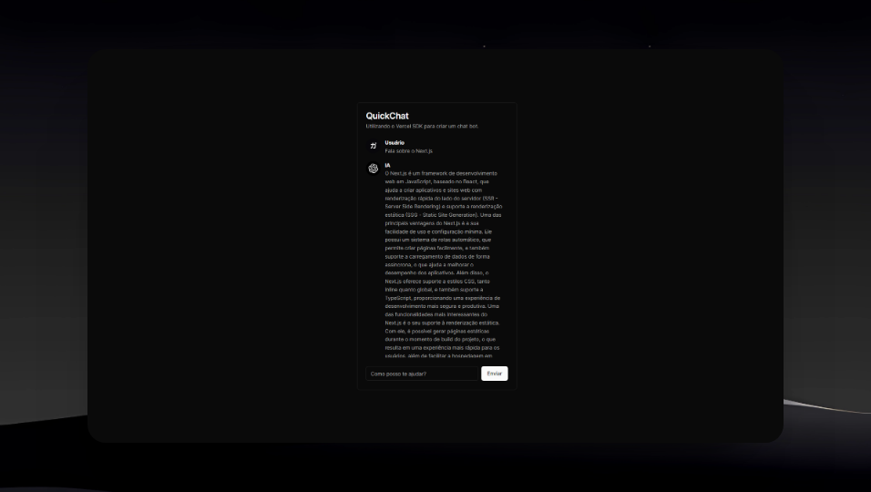

## QuickChat
Chatbot that uses the powerful OpenAI API to create engaging and personalized conversational experiences.



## Dependencies
- Next.js
- TypeScript
- OpenAI API
- Vercel SDK
- Tailwind CSS + shadcn/ui

## Use the QuickChat

> Clone the repository

```bash
git clone https://github.com/guhrodriguess/quickchat.git
```

## Run a application

```bash
cd quickchat
```

> Install of dependencies

```bash
npm i -g pnpm
```

```bash
pnpm install
```

> Enter the environment variable

```bash
OPENAI_API_KEY=""
```
_You can get your API key by clicking [here](https://openai.com/blog/openai-api)._

> Start the project

```bash
pnpm run dev
```
